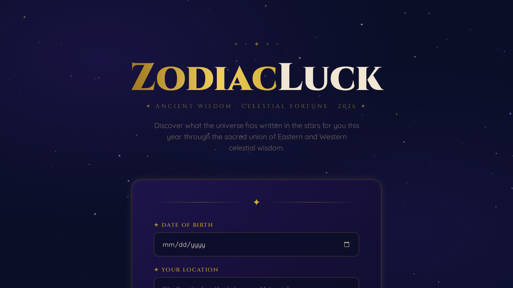
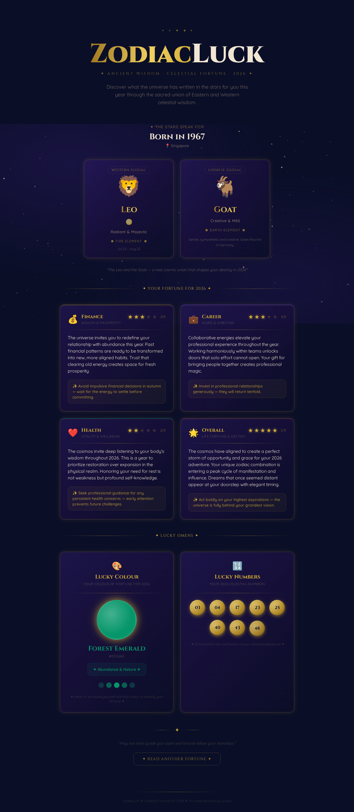
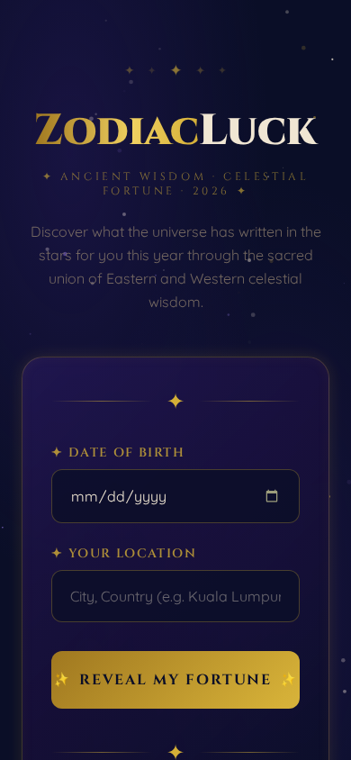
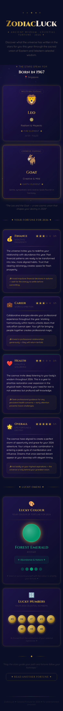

# ✨ ZodiacLuck — Your Celestial Fortune for 2026

A mystical, celestial web app that reveals your fortune through the ancient wisdom of **Chinese Zodiac** and **Western Zodiac** signs.

🌐 **Live App:** [https://alfredang.github.io/zodiacluck/](https://alfredang.github.io/zodiacluck/)

## Screenshots

### Desktop
| Landing Page | Fortune Results |
|:---:|:---:|
|  |  |

### Mobile
| Landing Page | Fortune Results |
|:---:|:---:|
|  |  |

## Features

- 🔮 **Dual Zodiac Detection** — Western (Aries → Pisces) + Chinese (Rat → Pig) from your birthday
- 💰 **Fortune Cards** — Finance, Career, Health & Overall with star ratings and mystical text
- 🎨 **Lucky Colour** — Your celestial colour of 2026 with beautiful gradient swatch
- 🔢 **Lucky Numbers** — 8 unique lottery-style numbers (1–49) divined from your zodiac combo
- ✨ **Deterministic Fortunes** — Same birthday always returns the same fortune (seeded hash)
- 🌟 **Animated Starfield** — Living canvas background with twinkling stars
- 💫 **Staggered Animations** — Fortune cards reveal with beautiful entrance effects
- 📱 **Fully Responsive** — Pixel-perfect on mobile, tablet, and desktop

## Tech Stack

| Technology | Purpose |
|---|---|
| **Vite** | Lightning-fast build tool |
| **React 18** | Component-based UI |
| **Tailwind CSS** | Utility-first styling |
| **Canvas API** | Animated starfield background |
| **GitHub Actions** | Auto-deploy to GitHub Pages |

## Design

- **Palette:** Deep Navy `#0a0e27` · Celestial Gold `#d4af37` · Cosmic Purple `#2d1b69` · Star White `#f0e6d3`
- **Typography:** [Cinzel](https://fonts.google.com/specimen/Cinzel) (headings) · [Quicksand](https://fonts.google.com/specimen/Quicksand) (body)
- **Aesthetic:** Mystical art-deco meets celestial — gold foil on deep navy, sacred geometry vibes

## Getting Started

```bash
# Install dependencies
npm install

# Start dev server
npm run dev

# Build for production
npm run build
```

Auto-deploys to GitHub Pages on push to `main` via GitHub Actions.

## Architecture

```
src/
├── App.jsx                  # Main app orchestrator
├── components/
│   ├── StarBackground.jsx   # Canvas animated starfield
│   ├── InputForm.jsx        # DOB + Location form
│   ├── ZodiacDisplay.jsx    # Western + Chinese zodiac cards
│   ├── FortuneCard.jsx      # Fortune category card
│   ├── LuckyColor.jsx       # Lucky colour swatch
│   └── LuckyNumbers.jsx     # Lottery ball numbers
├── utils/
│   ├── westernZodiac.js     # Aries → Pisces detection
│   ├── chineseZodiac.js     # Rat → Pig with CNY dates (1924-2043)
│   ├── fortuneGenerator.js  # Seeded deterministic fortunes
│   └── hashUtils.js         # LCG RNG + Fisher-Yates shuffle
└── data/
    └── fortunes.js          # Fortune texts + lucky colours
```

---

*For entertainment purposes. May the stars guide your path ✦*
